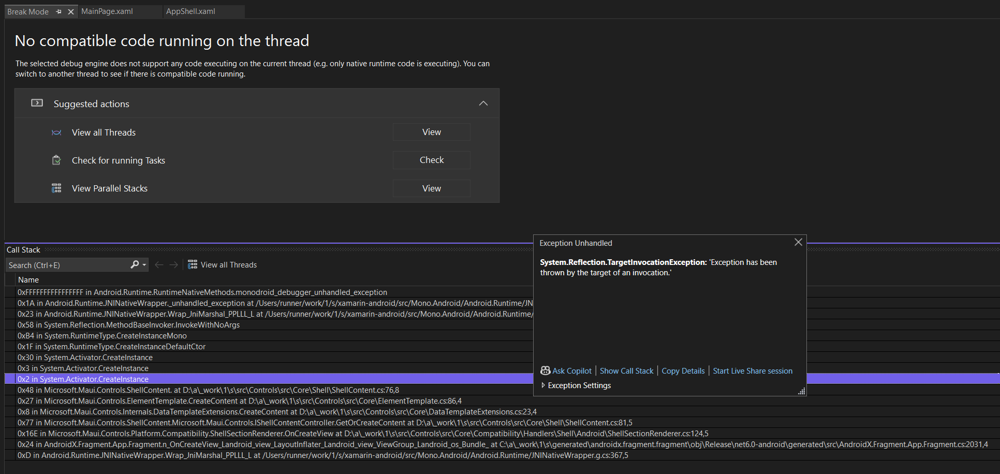
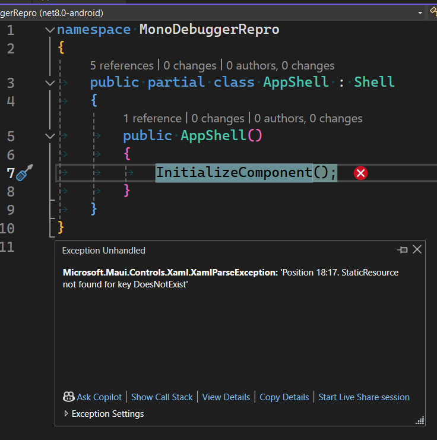

# MonoDebuggerRepro

Reproduces an issue when the debugger "breaks" on an exception.

## Steps to reproduce

1. `dotnet new maui`

2. Change any `<Label/>` to use a `Style` that does not exist:

```xml
<Label
    Text="Hello, World!"
    Style="{StaticResource DoesNotExist}"
    SemanticProperties.HeadingLevel="Level1" />
```

This could be pretty much any subtle XAML error, such that you get no
build errors and get a runtime error instead.

3. Build & run the app on Android in a debugger (I used Visual Studio 2022 on Windows):



## Workaround

For some reason, changing the app to use different XAML in `AppShell.xaml`:

```xaml
<!-- Change this -->
<ShellContent
    Title="Home"
    ContentTemplate="{DataTemplate local:MainPage}" />

<!-- To this -->
<ShellContent Title="Home">
    <local:MainPage />
</ShellContent>
```

It works as expected:



Note that the workaround no longer has `Activator.CreateInstance()` in
the call stack.

## Impact

Because this is setup in the .NET MAUI project template, there are a
class of runtime errors that are difficult to understand the
underlying cause. If you hit F5 and let the application terminate, you
can see the *actual* error in the output window, but it's not obvious
that this is the case.
